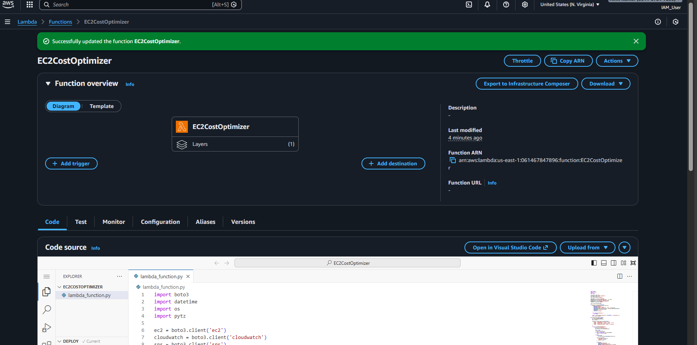
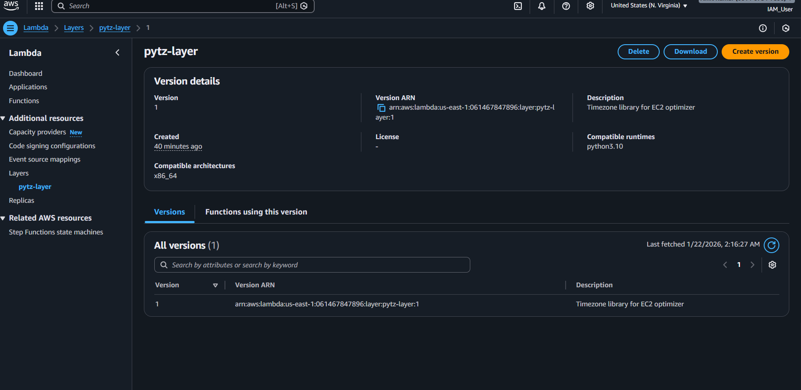
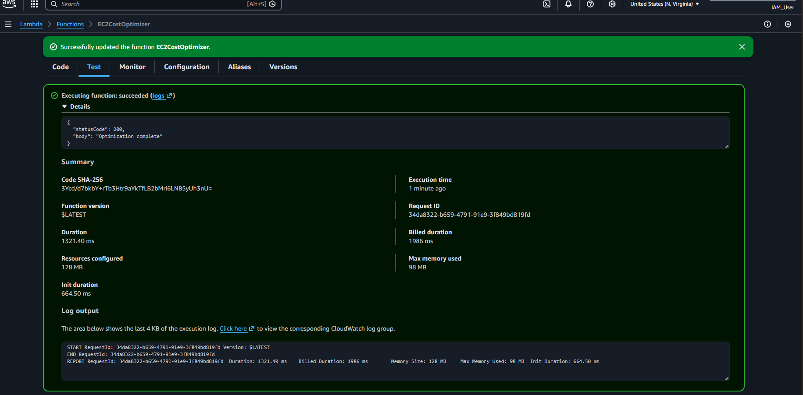
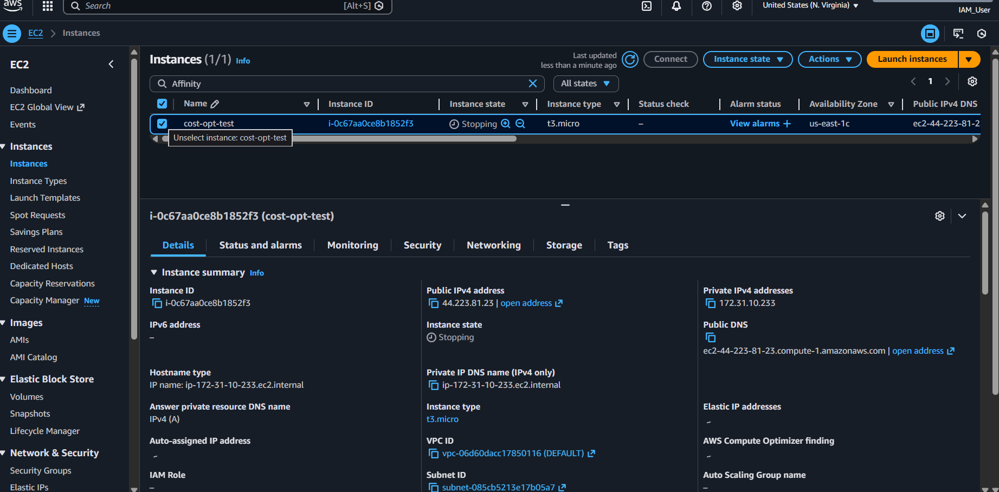

# AWS EC2 Cost Optimizer — Step-by-Step Build Guide

This comprehensive guide walks you through building the entire serverless automation system from scratch.

## PHASE 0 — Prerequisites

Before starting, ensure you have:
*   AWS Account
*   Basic Python knowledge
*   One EC2 instance for testing (Free Tier is fine)
*   AWS Console access

---

## PHASE 1 — Create Required AWS Resources

### 1. Create DynamoDB Table (for logs)
1.  Go to **AWS Console** → **DynamoDB**.
2.  Click **Create table**.
3.  **Table name**: `EC2OptimizationLogs`
4.  **Partition key**: `InstanceId` (String)
5.  **Sort key**: `Timestamp` (String)
6.  Leave all defaults and click **Create table**.

### 2. Create SNS Topic (for email alerts)
1.  Go to **AWS Console** → **SNS**.
2.  Click **Create topic**.
3.  **Type**: Standard
4.  **Name**: `EC2OptimizerAlerts`
5.  Click **Create topic**.

### 3. Subscribe Your Email to SNS
1.  Open your new SNS topic (`EC2OptimizerAlerts`).
2.  Click **Create subscription**.
3.  **Protocol**: Email
4.  **Endpoint**: *Your email address*
5.  Click **Create subscription**.
6.  **Check your email** and click "Confirm subscription".

    

---

## PHASE 2 — Create IAM Role for Lambda

### 4. Create Lambda Execution Role
1.  Go to **AWS Console** → **IAM**.
2.  Click **Roles** → **Create role**.
3.  **Trusted entity**: AWS service
4.  **Use case**: Lambda
5.  Click **Next**.

### 5. Attach Permissions Policy
1.  Click **Create policy** (or use inline policy).
2.  Paste the following JSON:
    ```json
    {
      "Version": "2012-10-17",
      "Statement": [
        {
          "Effect": "Allow",
          "Action": [
            "ec2:DescribeInstances",
            "ec2:StopInstances"
          ],
          "Resource": "*"
        },
        {
          "Effect": "Allow",
          "Action": [
            "cloudwatch:GetMetricStatistics"
          ],
          "Resource": "*"
        },
        {
          "Effect": "Allow",
          "Action": [
            "dynamodb:PutItem",
            "dynamodb:Query",
            "dynamodb:Scan",
            "dynamodb:DescribeTable"
          ],
          "Resource": "*"
        },
        {
          "Effect": "Allow",
          "Action": [
            "sns:Publish"
          ],
          "Resource": "*"
        },
        {
          "Effect": "Allow",
          "Action": [
            "logs:CreateLogGroup",
            "logs:CreateLogStream",
            "logs:PutLogEvents"
          ],
          "Resource": "*"
        }
      ]
    }
    ```
3.  **Role name**: `EC2CostOptimizerRole`
4.  Click **Create role**.

    

---

## PHASE 3 — Create Lambda Function

### 6. Create Lambda Function
1.  Go to **AWS Console** → **Lambda**.
2.  Click **Create function**.
3.  **Author from scratch**.
4.  **Name**: `EC2CostOptimizer`
5.  **Runtime**: Python 3.10
6.  **Role**: Use existing role → `EC2CostOptimizerRole`.
7.  Click **Create function**.

    

### 7. Paste Lambda Code
1.  Go to the **Code** tab.
2.  Replace everything in `lambda_function.py` with:
    ```python
    import boto3
    import datetime
    import os
    import pytz

    ec2 = boto3.client('ec2')
    cloudwatch = boto3.client('cloudwatch')
    sns = boto3.client('sns')
    ddb = boto3.resource('dynamodb')

    TABLE_NAME = os.environ['TABLE_NAME']
    SNS_TOPIC_ARN = os.environ['SNS_TOPIC_ARN']
    DRY_RUN = os.environ['DRY_RUN'].lower() == "true"
    CPU_THRESHOLD = int(os.environ['CPU_THRESHOLD'])
    TIMEZONE = os.environ['TIMEZONE']

    table = ddb.Table(TABLE_NAME)

    def get_cpu_utilization(instance_id):
        response = cloudwatch.get_metric_statistics(
            Namespace='AWS/EC2',
            MetricName='CPUUtilization',
            Dimensions=[{'Name': 'InstanceId', 'Value': instance_id}],
            StartTime=datetime.datetime.utcnow() - datetime.timedelta(minutes=30),
            EndTime=datetime.datetime.utcnow(),
            Period=300,
            Statistics=['Average']
        )

        if not response['Datapoints']:
            return None

        latest = sorted(response['Datapoints'], key=lambda x: x['Timestamp'])[-1]
        return latest['Average']

    def lambda_handler(event, context):
        tz = pytz.timezone(TIMEZONE)
        now = datetime.datetime.now(tz)
        hour = now.hour

        instances = ec2.describe_instances(Filters=[
            {'Name': 'tag:AutoStop', 'Values': ['Yes']},
            {'Name': 'tag:Environment', 'Values': ['Dev', 'Test']},
            {'Name': 'tag:Critical', 'Values': ['No']},
            {'Name': 'instance-state-name', 'Values': ['running']}
        ])

        for res in instances['Reservations']:
            for inst in res['Instances']:
                instance_id = inst['InstanceId']
                cpu = get_cpu_utilization(instance_id)

                reason = None
                if hour >= 20 or hour < 8:
                    reason = "After hours"
                elif cpu is not None and cpu < CPU_THRESHOLD:
                    reason = f"Low CPU: {cpu}%"

                if reason:
                    if not DRY_RUN:
                        ec2.stop_instances(InstanceIds=[instance_id])

                    table.put_item(Item={
                        "InstanceId": instance_id,
                        "Timestamp": str(now),
                        "Reason": reason
                    })

                    sns.publish(
                        TopicArn=SNS_TOPIC_ARN,
                        Subject="EC2 Optimization Alert",
                        Message=f"Stopped {instance_id} due to {reason}"
                    )

        return {"statusCode": 200, "body": "Optimization complete"}
    ```
3.  Click **Deploy**.

---

## PHASE 4 — Add Environment Variables

### 8. Add Environment Variables
1.  Go to **Configuration** → **Environment variables** → **Edit**.
2.  Add the following:
    | Key | Value |
    | :--- | :--- |
    | `DRY_RUN` | `true` |
    | `CPU_THRESHOLD` | `10` |
    | `TIMEZONE` | `Asia/Kolkata` |
    | `TABLE_NAME` | `EC2OptimizationLogs` |
    | `SNS_TOPIC_ARN` | *(Paste your SNS Topic ARN)* |
3.  Click **Save**.

---

## PHASE 5 — Add Lambda Layer (pytz)

### 9. Build pytz Layer Locally
On your computer (terminal):
```bash
mkdir python
pip install pytz -t python/
zip -r pytz-layer.zip python
```

### 10. Upload Lambda Layer
1.  Go to **AWS Console** → **Lambda** → **Layers**.
2.  Click **Create layer**.
3.  **Name**: `pytz-layer`
4.  **Upload**: `pytz-layer.zip`
5.  **Runtime**: Python 3.10
6.  **Architecture**: x86_64
7.  Click **Create layer**.

### 11. Attach Layer to Lambda
1.  Go back to Lambda function `EC2CostOptimizer`.
2.  Scroll to the **Layers** section (bottom of Code tab).
3.  Click **Add a layer**.
4.  Select **Custom layers**.
5.  Choose `pytz-layer` (Version: Latest).
6.  Click **Add**.

    

---

## PHASE 6 — Tag EC2 Instances

### 12. Add Tags to EC2 Instance
1.  Go to **EC2** → **Instances**.
2.  Select your test instance → **Tags** → **Manage tags**.
3.  Add the following tags:
    | Key | Value |
    | :--- | :--- |
    | `AutoStop` | `Yes` |
    | `Environment` | `Dev` |
    | `Critical` | `No` |

    

---

## PHASE 7 — Test Everything

### 13. Test Lambda (Safe Mode)
1.  Click the **Test** tab in Lambda.
2.  **Event name**: `manual-test`
3.  **JSON**: `{}`
4.  Click **Test**.
5.  **Expected output**:
    ```json
    {
      "statusCode": 200,
      "body": "Optimization complete"
    }
    ```

    

---

## PHASE 8 — Make It Real (Optional)

### 14. Enable Real Stopping
1.  Go to **Configuration** → **Environment variables**.
2.  Change `DRY_RUN` to `false`.
3.  **Save**.
4.  Re-test Lambda.
5.  **Result**: Your EC2 instance will actually stop!

    
    
    *Verify the action in CloudWatch Logs:*
    

---

## PHASE 9 — Automate It

### 15. Create EventBridge Rule
1.  Go to **EventBridge**.
2.  **Create rule**.
3.  **Name**: `EC2AutoStopRule`
4.  **Schedule**: `cron(0 20 * * ? *)` (Run every day at 8 PM UTC).
5.  **Target**: Lambda function
6.  **Function**: `EC2CostOptimizer`
7.  Click **Create rule**.

---

## YOU’RE DONE!

You now have a system that is:
*   **Fully serverless**
*   **Fully automated**
*   **Cost-optimized**
*   **Safe-tested**
*   **Production-grade**
