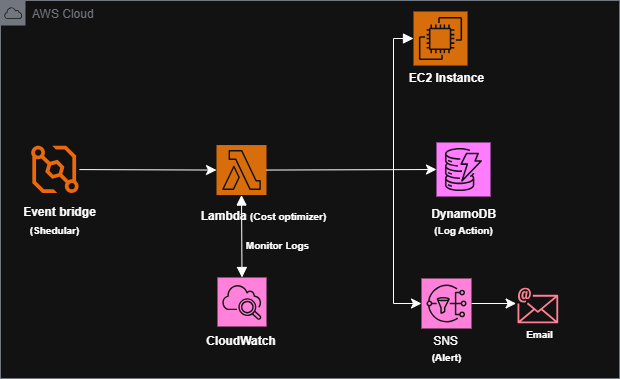
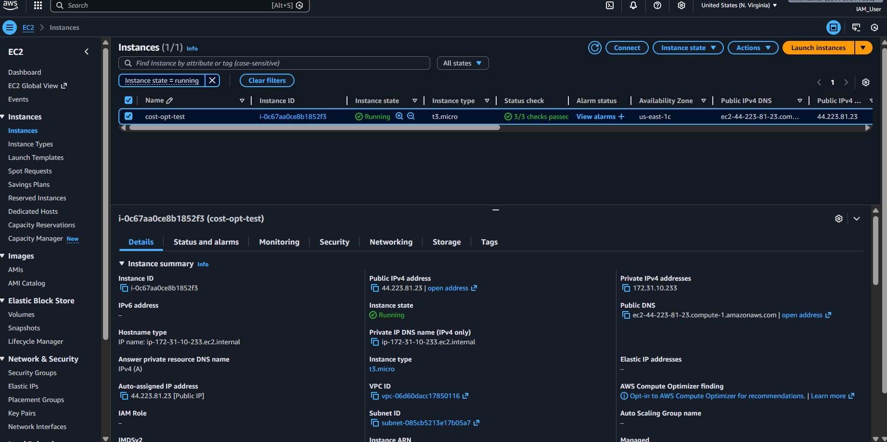
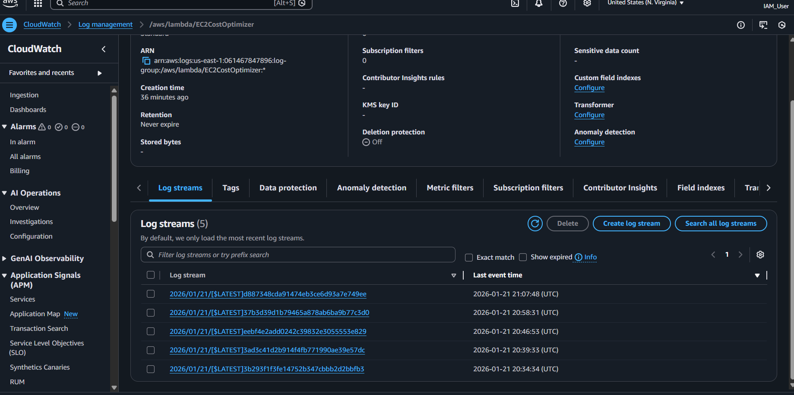
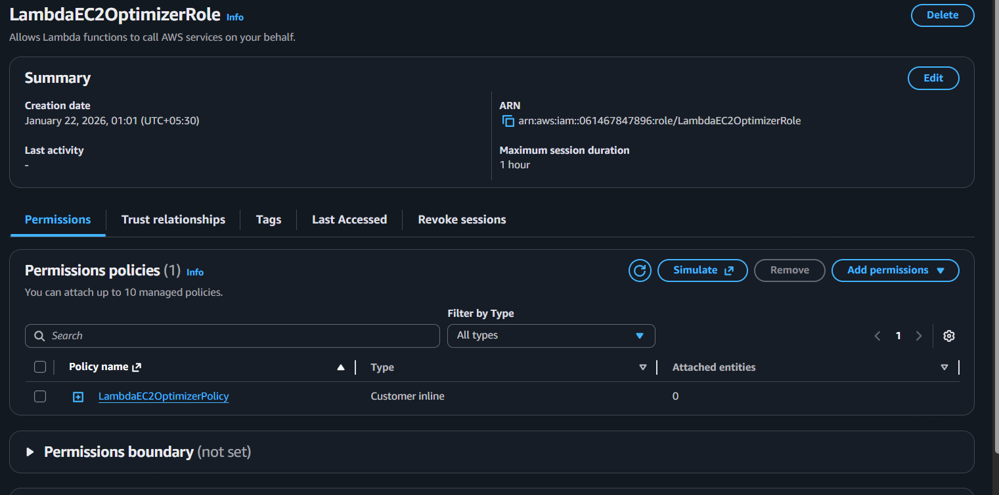

# AWS EC2 Cost Optimizer (Serverless Automation)


## >> Quick Links
> **Want to build this yourself?**
> *   [Doc] **Step-by-Step Guide:** [View DEMO.md](DEMO.md)
> *   [Blog] **Blog Post:** [Read the full article here](https://dev.to/amit_kumar_7db8e36a64dd45/cloud-cost-optimization-using-boto3-automating-ec2-management-with-aws-lambda-5g86)

## Project Overview

**AWS EC2 Cost Optimizer** is a production-grade serverless automation system designed to reduce cloud infrastructure costs by automatically stopping non-essential and underutilized EC2 instances.

Instead of manually monitoring server usage, this system acts as an intelligent cost-saving agent that runs 24/7 without human intervention.

### ? The Problem It Solves
In real-world AWS environments:
*   ($) **Wasted Spend**: Dev/Test EC2 instances run 24x7 unnecessarily.
*   (!) **Human Error**: Developers forget to stop machines after work.
*   (v) **Hidden Inefficiency**: Idle instances (low CPU) sit unnoticed, draining potential budget.
*   (?) **Lack of Visibility**: No audit trail exists for when or why instances were stopped.

### [ok] The Solution
This project solves these issues by implementing a **fully automated, serverless lifecycle**:
*   **Detects** idle or non-critical instances.
*   **Applies** smart business rules (Time + CPU + Tags).
*   **Stops** eligible instances automatically.
*   **Logs** every action for auditing.
*   **Alerts** the team instantly via email.

---

## High-Level Architecture

The system is built entirely on AWS Serverless primitives, ensuring zero maintenance and infinite scaling.



| Service | Purpose |
| :--- | :--- |
| **AWS Lambda** | Runs the core optimization logic (Python Boto3). |
| **Amazon EC2** | The target compute resources being optimized. |
| **Amazon CloudWatch** | Provides real-time CPU metrics for decision making. |
| **Amazon DynamoDB** | Stores an immutable audit log of every optimization action. |
| **Amazon SNS** | Sends real-time email alerts to administrators. |
| **Amazon EventBridge** | Schedules the automation to run hourly or at specific times. |
| **IAM** | Enforces strict least-privilege security permissions. |

---

## Decision Logic (The "Core Brain")

The system doesn't just randomly stop servers. An EC2 instance is stopped **only if ALL** the following conditions are met:

### 1. Tag-Based Filtering [Tag]
*Acts as a safety layer to ensure Production is never touched.*
*   `AutoStop` = **Yes**
*   `Environment` = **Dev** or **Test**
*   `Critical` = **No**

### 2. Time-Based Rules [Time]
Instances are eligible for stopping if it is **outside business hours**.
*   **After 8 PM** OR **Before 8 AM** (Configurable via Timezone).

### 3. CPU-Based Rules [CPU]
Instances are identified as "Idle" if:
*   **Average CPU Utilization < Threshold** (e.g., 5%) for the last 30 minutes.

### 4. Safety Switch (Dry Run) [Test]
*   **`DRY_RUN = true`**: Simulates the stop, logs the "would-be" action, but touches nothing.
*   **`DRY_RUN = false`**: Performs the actual API call to stop the instance.

---

## Configuration & Setup

All behavior is controlled via **Lambda Environment Variables**, allowing you to tune the system without changing code.

| Variable | Description | Example Value |
| :--- | :--- | :--- |
| `DRY_RUN` | Enable/Disable real actions. | `true` or `false` |
| `CPU_THRESHOLD` | The CPU % limit to consider an instance "idle". | `5` |
| `TIMEZONE` | Timezone for business hour calculations. | `US/Eastern` |
| `TABLE_NAME` | DynamoDB table for audit logs. | `EC2OptimizationLogs` |
| `SNS_TOPIC_ARN` | SNS Topic ARN for email alerts. | `arn:aws:sns:us-east-1:123456789012:MyTopic` |

---

## Project Tour

### 1. Instance Management
*Scanning for instances that match our specific tags.*


### 2. Execution & Logs
*Lambda successfully identifying triggers and identifying instances to stop.*


### 3. Security & Permissions
*Using IAM Roles with least-privilege access.*


---

## Data Flow & Auditing

Every single action taken by the bot is recorded in **DynamoDB** for compliance and cost analysis.

**Log Format:**
```json
{
  "InstanceId": "i-0abc12345",
  "Timestamp": "2026-01-22 20:15:04",
  "Reason": "After hours"
}
```

**Notification System:**
You receive an email immediately via SNS:
> **Subject:** EC2 Optimization Alert
>
> **Message:** Stopped i-0abc12345 due to Low CPU: 4.2%

---

## Deployment Guide

1.  **Create DynamoDB Table**: Create a table with `InstanceId` as the Partition Key.
2.  **Setup SNS**: Create a Topic and subscribe your email.
    
3.  **Deploy Lambda**:
    *   Upload `Lambda/lambda_function.py`.
    *   Add the `pytz` layer from `Lambda_Layer/`.
    *   Set Environment Variables.
4.  **Configure IAM**: Attach the policy from `IAM/policy.json`.
5.  **Schedule**: Use EventBridge to trigger the function every hour or at 8 PM.

---

## Testing Strategy

*   **Phase 1: Safe Mode (`DRY_RUN = true`)** -> Verify logic, logs, and alerts without touching servers.
*   **Phase 2: Real Mode (`DRY_RUN = false`)** -> Enable actul cost savings.
*   **Phase 3: Full Automation** -> Let EventBridge take the wheel.

---

## Troubleshooting & Learning

Building this project wasn't just smooth sailing. Here are the real-world challenges faced and how they were resolved:

### 1. Lambda Runtime Mismatch
*   **Issue:** Custom layer (`pytz`) didn't appear because it was built for Python 3.10 but Lambda was 3.14.
*   **Fix:** Downgraded Lambda runtime to **Python 3.10** and recreated the layer with compatible settings.

### 2. Lambda Layer Not Appearing
*   **Root Causes:**
    1.  Layer created in a different Region.
    2.  Incorrect ZIP structure (must be `python/pytz/...`).
*   **Fix:** Verified Region consistency and ensured the folder structure was exactly `python/` before zipping.

### 3. IAM Permission Denials (x)
*   **Issue:** Lambda failed to stop instances or write logs.
*   **Fix:** Systematically added missing permissions to the Execution Role:
    *   `ec2:StopInstances`
    *   `dynamodb:PutItem`
    *   `sns:Publish`

### 4. Configuration Errors (KeyError)
*   **Issue:** Code failed with `KeyError: 'EC2OptimizationLogs'`.
*   **Fix:** Standardized Environment Variable names (e.g., `TABLE_NAME`) in the Lambda Console to match the Python code exactly.

### 5. "It Says Stopped but It's Running!"
*   **Issue:** Logs said "Stopped", but the instance was still up.
*   **Root Cause:** The `DRY_RUN` variable was still set to `true`.
*   **Fix:** Switched `DRY_RUN = false` for production mode.


---

*Built with <3 for Cloud Cost Optimization.*
*Happy Deploying! <3*
